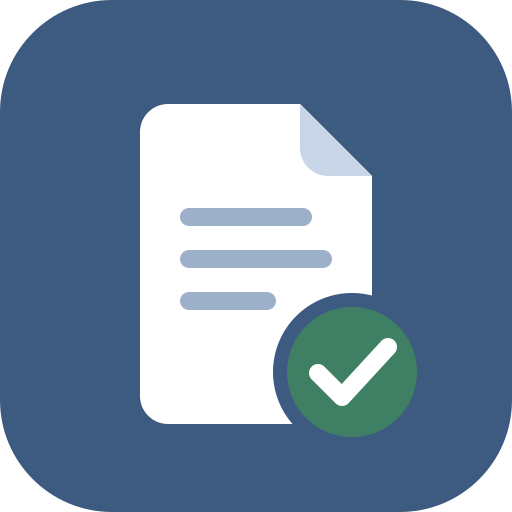

# Заметно — заметки и дела

Простое приложение для заметок: отметка о выполнении, поиск, корзина с восстановлением,
экспорт в PDF и Excel, резервная копия с импортом. Устанавливается на телефон, планшет и компьютер, работает без интернета.
Заметки хранятся только на устройстве пользователя.

**Открыть приложение:** https://kobyzev8051-creator.github.io/zametno/

## Установка

- **Android (Chrome):** кнопка «Установить» в приложении или меню ⋮ → «Установить приложение».
- **iPhone / iPad (Safari):** «Поделиться» □↑ → «На экран "Домой"» → «Добавить».
- **Компьютер (Chrome, Edge):** кнопка «Установить» в приложении или значок ⊕ в адресной строке.

Подробнее — [Инструкция пользователя](help.html) (также в [PDF](Инструкция%20пользователя.pdf)).

---

© 2026 Кобызев С. Е. Все права защищены.
